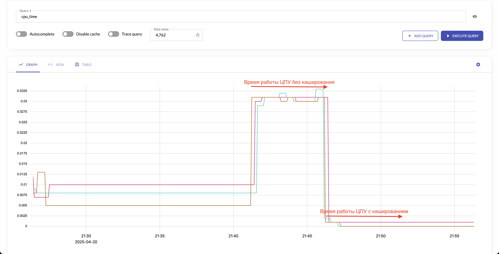

# Задание 1

Была добавлена новая метрика `cpu_time`, которая считает кол-во секунд, которое было затрачено не обработку запроса в контроллере.

Было выполнено нагрузочное тестирование с помощью ab.
Команда: `exec ab -n 25000 -c 100 "http://rails.think/cpu_bound?number=30"`
При такой нагрузке сервер не всегда способен отвечать на запрос `/metrics`, и на графиках будут пробелы.

# Задание 2

Реализовано кеширование для `cpu_bound` и `io_bound`.

По метрике CPU time видно, что время работы процессора сильно уменьшилось, когда подключили кеширование

# Задание 3

Leader Election был выполнен через Key Value Consul'а вместе с сессией Consul'а, которая сбрасывает
значение в KV.
